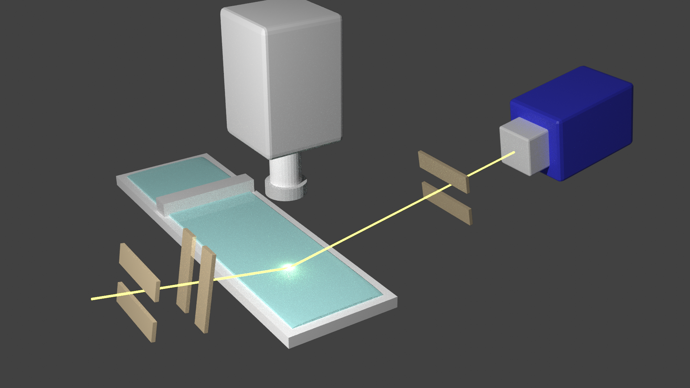
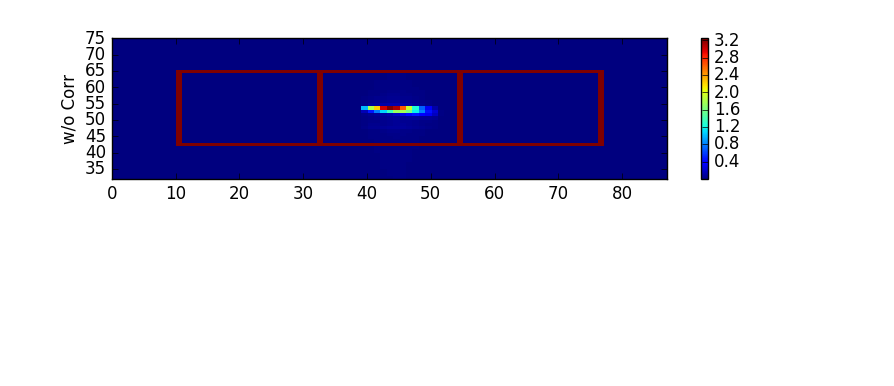
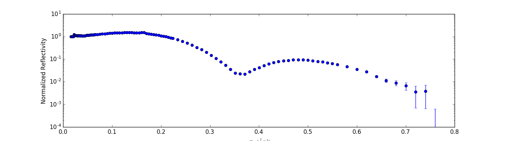
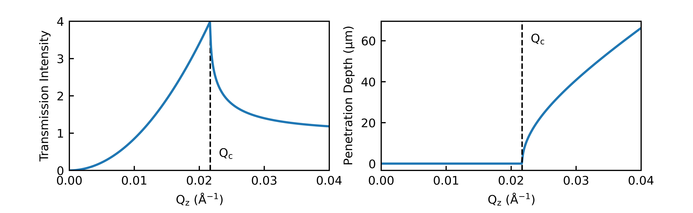
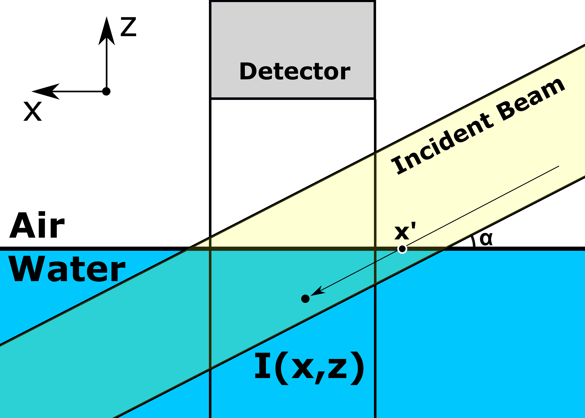

**Work in progress**

# 1. X-ray Experiments Analysis
I mainly conduct two types of X-ray experiments: X-ray scattering (reflectivity) and X-ray Fluorescence Near Total Reflection (XFNTR). Each experiment requires extensive signal processing and analysis procedures to extract scientific meanings. This section is intended to showcase how I went through all those processes.

{: .align-center}{:style="border: 0px solid black; padding: 10px"}{:height="75%" width="75%"}
__X-ray experiment setup. The blue box is an area detector that senses X-ray scattering signals and the gray box is a vortex meter that detects fluorescence signals.__  

## 1.1. X-ray Scattering
X-ray reflectivity is one of the most powerful tools to characterize the composition of the surface along the surface normal. The X-ray area detector is positioned accordingly to the incident angle to optimally collect signals from the reflected X-ray beam. Image processing should be preceded to properly analyze the X-ray reflectivity data.

### 1.1.1 Image Processing
The X-ray scattering method collects the intensity of the reflected beam at various angles. At each angle, the reflected beam intensity is read by the area detector. The area detector consists of many pixels, the smallest spatial resolution of the sensor, and returns an array full of numbers that represents the intensity of the beam reached to a certain pixel. It is crucial to process this image and extract the intensity of the "Real Reflection".

{: .align-center}{:style="border: 0px solid black; padding: 10px"}{:height="75%" width="75%"}

A typical scattering image is shown as above: The images that look like the above are collected from every designated angle. Since the size of the incident beam is regulated by slits and the position of the detector is finely controlled, the reflected beam should fall into a designated region (the center red square in this case). All signals in this region are summed up to represent the reflectivity signal. However, as you might notice, the actual reflectivity signal occupies only a small portion of the region of interest and it means it is very likely to contain a large amount of background noise as a relevant signal.

The background noise should be subtracted from the signal. The two red squares on each side play a role here. The background noise is calculated from each box and averaged. This way, we can subtract the noise from the middlebox and obtain the "real" reflection signal. By repeating this procedure for all angles, we can have an intensity profile over various angles as below.

{: .align-center}{:style="border: 0px solid black; padding: 10px"}{:height="75%" width="75%"}
**Reflected Intensity Profile as a Function of Angle**

### 1.1.2. Mathematical Formulation: X-ray Reflectivity
The specular reflectivity intensity profile as a function of incident (=reflection) angle (that we just obtained above) contains information about the electron density of the material along the z-axis (when a surface is an XY plane).

$$ \frac{R(Q_{z})} {R_{F} (Q_{z})} = \left| \frac{1}{\rho_{\infty}} \int \frac{d \rho (z)}{dz} e^{i Q_{z}z} dz \right| ^{2} $$

Herein, \\(R_{F}(Q_{z})\\) is a normalization factor, \\(Q_{z}\\) is a vector that is determined by the energy of the beam and angular difference between incident and reflected beams, \\(\rho(z)\\) is the electron density profile along the z-axis (EDP; what we want to know), and \\(\rho_{\infty}\\) is the electron density of the bulk of the substrate (water in my case). Shortly, the reflectivity shows us **the absolute square of the Fourier transform of the derivative of the electron density**.

**There is no easy way to calculate the \\(\rho(z)\\) from the equation above directly.** To make this problem solvable, people formulate the model EDP \\(\rho(z)\\) with some fitting parameters, and a **Slab Model** is one of the most widely used methods. This model consists of several conceptual slabs with uniform electron densities. The i-th slab has three fitting parameters: electron density \\(\rho_{i}\\), thickness \\(d_{i}\\), and roughness \\(\sigma_{i}\\). Then the model can be expressed as a sum of the error functions,

$$ \rho(z) = \rho_{0} + \sum_{i=1}^{N} \frac{\rho_{i}-\rho_{i-1}}{2} \left( erf \left( \frac{z-z_{i}}{\sqrt{2}\sigma_{i}} \right) +1 \right) $$

and allow us to deal with a more computer-friendly equation:

$$ \frac{R(Q_{z})} {R_{F} (Q_{z})} = \left| \sum_{i=0}^{N} \frac{\rho_{i}-\rho_{i+1}}{\rho_{\infty}} e^{-iQ_{z}d_{i}} e^{-Q_{z}^{2} \frac{\sigma_{i+1}^{2}}{2}} \right|^{2} $$

By minimizing the residual (chi-square) between the collected and the formulated reflectivity, the thickness, electron density, and roughness of each slab are determined.

## 1.2 X-ray Fluorescence Near Total Reflection (XFNTR)
XFNTR enables quantitative analysis of ions adsorbed to the surface. One of the fascinating features of the fluorescence technique is that it provides ion-selective information: You can calculate the number density of a "Target Ion" from the mixture sample. X-ray optics near the critical angle is manipulated to assign "surface only" detection of the fluorescence signals.

It uses a unique optical property of X-rays: Total reflection. It allows us to investigate the "surface-only" of a material of interest.

### 1.2.1. Incident Angle and "Surface-Only" mode of X-rays
When a beam meets the surface of matter, the incident beam is either reflected or transmitted (or refracted). The transmitted portion of the incident light can interact with matters and allow us to characterize the matter. The transmission (\\(T\\)) is sensitive to the angle of incidence. (See the graph below) From an angle higher than the critical angle (\\(\theta > \theta_{c}\\)), the beam penetrates the surface and reaches the bulk. The distance that the beam penetrates the matter is called "penetration depth (\\(\Lambda\\))". When the surface is shed from the small angle (\\(\theta < \theta_{c}\\)), the beam no longer penetrates the matter (only a few nanometers) but travels along the surface. This is manifested by a significant difference in penetration depth before and after the critical angle.

{: .align-center}{:style="border: 0px solid black; padding: 10px"}{:height="70%" width="70%"}

### 1.2.2. Mathematical Formulation of Fluorescence Signal Intensity
The fluorescence signal from an atom is linearly correlated with the beam intensity (by \\(C\\)) that reaches the location of the atom. Considering the "surface-only" mode described above, it is reasonable to split the overall fluorescence signal intensity into **surface**, **bulk**, and background noise terms. When variables are defined as a picture below, the fluorescence signal intensity can be formulated as the following equation.

{: .align-center}{:style="border: 0px solid black; padding: 10px"}{:height="70%" width="70%"}

$$\begin{align}\frac{I}{I_{0}} = & \frac{C}{A_{ion}} \int T(\alpha) e^{-\mu_{0}x'}dx'\\
& + C \cdot n_{ion} \int \int T(\alpha) e^{-|z|/\Lambda (\alpha)} e^{-\mu_{0}x'} dx'dz\\
& + I_{bg}/I_{0}
\end{align}$$

There is an assumption regarding the ion distribution near the surface. The ions are distributed uniformly in the bulk (with concentration of \\(n_{ion}\\)) and the adsorbed ions are located very close to the surface (depth negligible compared to the penetration depth, \\(\Lambda\\), with \\(A_{ion}\\) surface area per ion).

The first term calculates the signal contributed by the "surface" ions. Since the depth of the ions is negligible to the penetration depth, we only need to consider the transmitted intensity. The exponential term \\(e^{-\mu_{0}x'}\\) calculates the attenuation of the beam (the intensity loss when it travels through a non-vacuum media). The fluorescence signal from each point is then integrated over the area overlapped by the detection region and the footprint of the incident beam.

The second term is the contribution of the ions in the bulk. Since the depth of the ions is comparable to the penetration depth, an exponential of \\(\Lambda\\) times depth is multiplied by the transmission. The attenuation is considered again and integrated over the same region as the previous.

The last term is dedicated to the background noise signal. It has no significant physical meaning, but allows us to optimize further during the parameter estimation process (\\(A_{ion}\\)).

# 2. Kinetic Model of Solvent Extraction (ICP-MS)
For one of my research projects, I needed to evaluate the performance of solvent extraction (extracting a target ion from water to an organic solvent) over processed time. One of the ways to evaluate the extraction performance is to **measure the "residual" concentration** in the water at designated times with ICP-MS to calculate the extracted concentration. The Inductively Coupled Plasma Mass Spectrometry (ICP-MS) consists of, not too surprisingly, the ICP part and MS part. The ICP part nebulizes the sample solution to aerosol and ionizes the elements in the aerosol with Argon plasma. The ionized elements go through the MS part and their charge-mass ratio is measured under a magnetic field. From the signal intensity from each charge-mass channel, the element concentration and composition in the feed solution are measured. 0My mission is to convert the ICP-MS data to an extraction curve and formulate the extraction kinetics mathematically to extract scientific meanings.

## 2.1. ICP-MS signal to Extraction Performance
All elements in the world have various mass numbers because of the existence of isotopes. For example, erbium (Er; Atomic Number 68) has 6 stable isotopes; \\(^{162}Er\\), \\(^{164}Er\\), \\(^{166}Er\\), \\(^{167}Er\\), \\(^{168}Er\\), and \\(^{170}Er \\). Due to different mass, the mass-spectrometry can distinguish the isotopes of the same element and reads concentrations of each isotope. The software integrated into the equipment calculates the element concentration (in ppb) from each isotope by dividing the concentration of isotope by its abundance. For example, if I analyze \\(^{166}\\)Er, \\(^{167}\\)Er, and \\(^{168}\\)Er, the software returns the concentration of Er from 3 channels (each assigned to each isotope). I took the average of those concentrations as the representative residual element concentration.  
**Example: ICP-MS dataformat for Er and Nd mixture samples. Er concentration: AVG of Er conc 1~3 and Nd concentration: AVG of Nd conc 1~6**

| **Label**  | **142Nd** | **143Nd** | **144Nd** | **145Nd** | **146Nd** | **148Nd** | **166Er** | **167Er** | **168Er** |
|:----------:|:---------:|:---------:|:---------:|:---------:|:---------:|:---------:|:---------:|:---------:|:---------:|
| SAMPLE 1   | *Nd conc1* | *Nd conc2*  | *Nd conc3*  | *Nd conc4*  | *Nd conc5*  | *Nd conc6*  | *Er conc1*  | *Er conc2*  | *Er conc3*  |
| SAMPLE 2   | *Nd conc1* | *Nd conc2*  | *Nd conc3*  | *Nd conc4*  | *Nd conc5*  | *Nd conc6*  | *Er conc1*  | *Er conc2*  | *Er conc3*  |

 Once the "residual" concentration at a givne time (\\(c(t)\\)) is calculated, it need to be converted to the "extracted" concnentration. This is a quite simple task. Measure the concentration before the extraction (\\(c_{0}\\)), then the extracted concentration after t-minutes of extraction process (\\(E(t)\\)) is defned as follows:

$$ E(t) = \left( 1-\frac{c(t)}{c_{0}} \right) $$

**Update Figure after publishing paper: A graph without fittng curve**

## 2.2. Order of Chemical Reaction
The rate of chemical reaction is known to be proportional to the reactant concentration. 

## 2.3. Non-Linear Regression and Its Interpretation
Exponentials and their interpretation

# 3. Isotherm of Langmuir Monolayer
Brief description of Langmuir monolayer

## 3.1. Trouble Shooting: Langmuir Trough and the Barrier Position
Malfunctioning barrier position sensor.

## 3.2. Software Approach Problem Solving
Include code