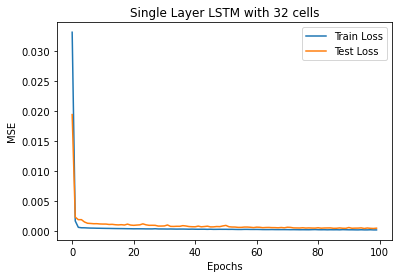
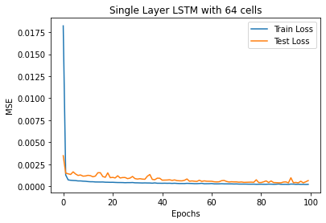
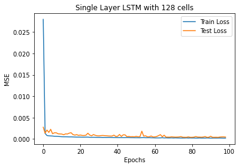

**Work in progress: Post what I have studied**

# Predict the Open and Close prices of the S&P 500 Index with LSTM
I made an LSTM model that predicts the open and close price of the S&P 500 index based on historical data. The historical price data (past 5 years) is scraped from Google Finance. The open and close prices of the next date are predicted based on the past 30 days' data with 5 features: Open, Close, High, Low, and Volume. The first 80% was used as training data, the next 10% as test data, and the last 10% as evaluation data (back-testing). The model evaluation is processed as follows. The model trained with a training set is evaluated with test data to estimate the performance of the model with unseen data. The model has been trained again with the train+test dataset (first 80%+10% = 90%) and evaluated again with the evaluation set. If the model performs as predicted, the evaluation metric from the previous step and this step should be similar to each other.

## Why LSTM?
By the time I started this project, the only deep learning technique that I know was Artificial Neural Network (ANN). There are several shortcomings with ANN to make a prediction model with historic data (time-series or sequential data). The problem arises from:
* Increased feature dimension
* Train/Test split

### *Why not ANN: Increased Feature Dimension*
The ANN cannot tell the past/future data. It predicts the value from the same data entry (i.e. predict one value from other columns within the same row). Therefore, it is necessary to increase the feature dimension to contain the past data within a row. For example, the past data such as a mean of the past 3 days, 5days, ... should be added after the original features. To get an acceptable prediction power, I had to expand the feature dimension by 53, which is exactly the opposite of an ideal situation. Other than this, there are more serious problems left.

### *Why not ANN: Test/Train Split*
To avoid overfitting, it is necessary to test the trained model with "unseen" data. A random split of the data is a typical way to deal with this problem. Randomized splitting is necessary to avoid biased sampling. In this case, however, the random split cannot produce the "unseen" test data. Let's assume the mean of the past 3 days has been added as a feature. If the "random" split assigns 500th data to the test set and 501st to the training set, the model "sees" the information from the 500th entry (test) as a form of a mean of the past 3 days. Therefore, there is no truly unseen test data with the randomized split.

### *Why not RNN*
After doing some research I found that __Recurrent Neural Network (RNN)__ is capable of dealing with sequential data (or equivalently called as "time-series" data). However, RNN could not predict the S&P prices as well as I wished. The RNN algorithm can hardly deal with the old data becuase it uses fixed weight. <br/>
For example, I am dealing with sequential data that contains information from past 30 steps. It means the oldest data will be multiplied by weight 30 times: \\(a_{30} = a_{0} W^{30}\\).

## Data Engineering: Scaling and Sequential
To feed data to the LSTM cells, the data should be converted to the "sequential" form. Define a function that takes data, features of interest, and number of timesteps and return the sequential format of the input data.

```ruby
# Define a function that reframe data (include past 30 days data)
def make_sequential_data(X,features,num_timesteps=30):
    """
    Take data X, len_days (number of past days to make a model out of)
    i-th date: data should be 2-D tensor for a day. len_days rows
    The overall data will be (date x num_timesteps x num_features) 3-D tensor
    """
    data=[]
    y=[]
    Y = X[features]
    Y = np.array(Y)
    X = np.array(X)
    for i in range(num_timesteps, len(X)): # range: start point inclusive, end point exclusive (i=30 ~ len(X)-1)
        data.append(X[i-num_timesteps:i]) # -30 days to current date (i-th date), 5 features
        y.append(Y[i]) # i+1-th date: indexing starts from 0
    return np.array(data), np.array(y)
```

The training data has been scaled using MinMaxScaler() in SciKit-Learn library. I choose MinMaxScaler (scale numbers between 0 and 1) over StandardScaler because the price value itself looks more relevant to the prediction than the Z-score (StandardScaler). All data entry has been scaled with the same scaler object that used to transform the training data. This is to avoid information leakage from the test or evaluation set.

## Modeling and Optimization
The following libraries are used to make, optimize, and evaluate the LSTM model. For optimization, I make LSTM model with 32, 64, and 128 cells and choose the best. Learning curve and Root Mean Square Error are reported to choose a right model. I also plotted the __probability density function of residue of the prediction (real-prediction)__ to visuallize the model prediction performance. Ideally, the pdf should look like a gaussian peak centered at 0 with small standard deviation.

* __Import Libraries__
```ruby
from tensorflow.keras.models import Sequential
from tensorflow.keras.layers import LSTM, Dense
from tensorflow.keras.callbacks import EarlyStopping
from sklearn.metrics import mean_squared_error, mean_absolute_error
```

* __Make model and plot learning curve__
```ruby
def single_layer_model(scaled_X_train, scaled_X_test, scaled_y_train, scaled_y_test, num_cells, epochs):
    model = Sequential()
    # Input shape should be (num_timesteps, num_features)
    model.add(LSTM(units=num_cells, activation='tanh', input_shape=scaled_X_train[0].shape)) 
    model.add(Dense(2)) # Return two values: "Open" and "Close"
    
    model.compile(optimizer='adam', loss='mean_squared_error')
    
    # Early stop condition: no improve for next 10 points
    early_stop = EarlyStopping(monitor="val_loss", patience=10)
    model.fit(scaled_X_train, scaled_y_train, epochs=epochs, 
              validation_data=(scaled_X_test, scaled_y_test),
              callbacks=[early_stop], verbose=0)
    
    plt.figure()
    plt.title(f"Single Layer LSTM with {num_cells} cells")
    plt.plot(model.history.history['loss'], label='Train Loss')
    plt.plot(model.history.history['val_loss'], label='Test Loss')
    plt.xlabel('Epochs')
    plt.ylabel('MSE')
    plt.legend()
    
    return model
```

* __Evaluation report function__
```ruby
def model_evaluation(model, scaled_X_test, scaled_y_test, scaler2, num_cells):
    """
    Evaluate the Model with Test set
    """
    plt.figure()
    scaled_y_pred_test = model.predict(scaled_X_test, verbose=0)
    y_test = scaler2.inverse_transform(scaled_y_test)
    y_pred_test = scaler2.inverse_transform(scaled_y_pred_test)
    
    plt.plot(df.index[-round(0.2*len(scaled_X)):-round(0.1*len(scaled_X))],y_test[:,0],color='tab:blue', label="Real Open Price")
    plt.plot(df.index[-round(0.2*len(scaled_X)):-round(0.1*len(scaled_X))],y_test[:,1],color='tab:orange', label="Real Close Price")
    plt.plot(df.index[-round(0.2*len(scaled_X)):-round(0.1*len(scaled_X))],y_pred_test[:,0],color='tab:blue',linestyle='--', label="Predicted Open Price")
    plt.plot(df.index[-round(0.2*len(scaled_X)):-round(0.1*len(scaled_X))],y_pred_test[:,1],color='tab:orange',linestyle='--', label="Predicted Close Price")
    plt.xticks(rotation=90)
    plt.xlabel('Date')
    plt.ylabel('Index')
    plt.title(f'S&P 500 Index Price predicted with {num_cells} LSTM cells')
    plt.legend()
    
    print(f'====== {num_cells} cells LSTM Model ======')
    print(f'Mean Real Open Price: {y_test[:,0].mean().round(2)}')
    print(f'Mean Predicted Open Price: {y_pred_test[:,0].mean().round(2)}')
    print(f'MAE Open: {round(mean_absolute_error(y_test[:,0],y_pred_test[:,0]),2)}')
    print(f'RMS Open: {round(mean_squared_error(y_test[:,0],y_pred_test[:,0])**0.5,2)}')
    print("")
    print(f'Mean Real Close Price: {y_test[:,1].mean().round(2)}')
    print(f'Mean Predicted Close Price: {y_pred_test[:,1].mean().round(2)}')
    print(f'MAE Close: {round(mean_absolute_error(y_test[:,1],y_pred_test[:,1]),2)}')
    print(f'RMS Close: {round(mean_squared_error(y_test[:,1],y_pred_test[:,1])**0.5,2)}')
    print('')
    
    plt.figure()
    plt.title("Real-Prediction PDF")
    plt.axvline(0,0,1, linewidth=1, linestyle='--', label="Perfect Prediction")
    sns.kdeplot(y_test[:,0]-y_pred_test[:,0], color='tab:blue', label="Open Price")
    sns.kdeplot(y_test[:,1]-y_pred_test[:,1], color='tab:orange', label="Close Price")
    plt.legend()
```

The functions defined above are used to automate the creation, optimization, and evaluation of LSTM models with 32, 64, and 128 LSTM cells.

* __Automation__
```ruby
models = []
for num_cells in [32, 64,128]:
    model = single_layer_model(scaled_X_train, scaled_X_test, scaled_y_train, scaled_y_test, num_cells, epochs=100)
    models.append(model)
    model_evaluation(model, scaled_X_test, scaled_y_test, scaler2, num_cells)
```

* __Result__<br/>
{: .align-left}{:style="border: 0px solid black; padding: 10px"}
====== 32 cells LSTM Model ======<br/>
Mean Real Open Price: 4543.34<br/>
Mean Predicted Open Price: 4559.81982421875<br/>
MAE Open: 30.71<br/>
RMS Open: 40.32<br/>

Mean Real Close Price: 4541.39<br/>
Mean Predicted Close Price: 4559.91015625<br/>
MAE Close: 48.0<br/>
RMS Close: 60.31<br/>

{: .align-left}{:style="border: 0px solid black; padding: 10px"}
====== 64 cells LSTM Model ======<br/>
Mean Real Open Price: 4543.34<br/>
Mean Predicted Open Price: 4572.27978515625<br/>
MAE Open: 32.19<br/>
RMS Open: 40.18<br/>

Mean Real Close Price: 4541.39<br/>
Mean Predicted Close Price: 4585.1298828125<br/>
MAE Close: 54.44<br/>
RMS Close: 69.7<br/>

{: .align-left}{:style="border: 0px solid black; padding: 10px"}
====== 128 cells LSTM Model ======<br/>
Mean Real Open Price: 4543.34<br/>
Mean Predicted Open Price: 4514.02978515625<br/>
MAE Open: 35.01<br/>
RMS Open: 41.64<br/>

Mean Real Close Price: 4541.39<br/>
Mean Predicted Close Price: 4537.4501953125<br/>
MAE Close: 43.0<br/>
RMS Close: 53.21<br/>


# Artificial Neural Network (ANN) and Backpropagation
Input: 2 numbers

Output: 2 numbers

2 hidden layers
## a
a
## b
b
## c
c

# RNN
RNN and its limitation
