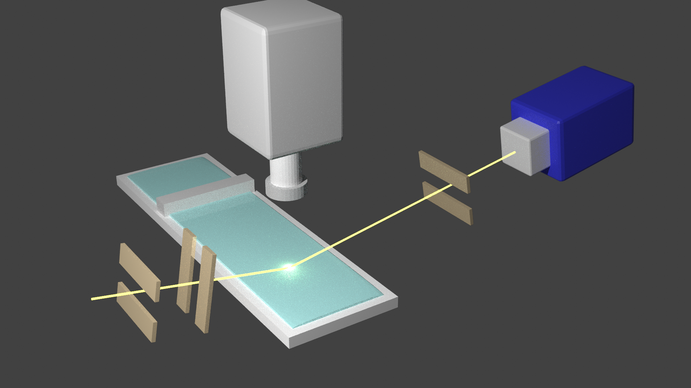
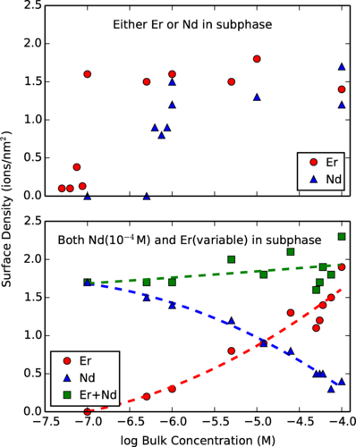

# Retrieving precious Lanthanide Ions Selectively from Water

{: .align-right}{:style="border: 0px solid black; padding: 10px"}{:height="50%" width="50%"}

Solvent Extraction, a mechanism that transfers ions from water to oil with the assistance of amphiphilic molecules (extractant), is a widely used method to retrieve and separate precious lanthanide elements from wastewater.
However, lack of selectivity leads to hundreds of cycles of solvent extraction to achieve industry-relevant purity which makes the process energy-intensive and generates huge environmental pollutants.

Understanding the transferring mechanism of metallic ions through the water surface is essential to optimizing and improving the selectivity of the separation process.
I have been researching the adsorption of Lanthanide elements to a charged extractant Langmuir monolayer at the air-water interface on the molecular scale with synchrotron-sourced X-rays.

## Electrostatic Origin of Lanthanide Adsorption to a Monolayer
{: .align-right}{:style="border: 0px solid black; padding: 0px"}{:height="40%" width="40%"}

* Ubiquitous rule in lanthanide extraction: Heavier elements extracted better than the Lighter ones
* Step-wise trend of ion adsorption to a charged floating monolayer: Explained with electrostatic interaction
* Selective adsorption of heavier lanthanide is observed with the mixture solution

## Spontaneous & Ion-Specific Complexation of Heavier Lanthanide with Extractant at the Air-Water Interface
{: .align-left}{:style="border: 0px solid black; padding: 0px"}{:height="50%" width="50%"}

* Extractant molecules form monolayers at the air-water and liquid-liquid interface
* It is still true when there is a light lanthanide element (an atomic number less than 65) in the solution
* However, with heavier lanthanide elements (Z>65), a characteristic bilayer structure was found with X-ray scattering
* The easily-detachable nature of the ion-specific complex structure can be beneficial to the selective extraction of heavier lanthanide elements

## The Role of the Bilayer Structure in the Solvent Extraction

{: .align-right}{:style="border: 0px solid black; padding: 10px"}{:height="50%" width="50%"}

* Performed model extractions with Er (heavier & bilayer) and Nd (lighter & monolayer)
* Role of the bilayer structure during the solvent extraction was studied
* The bilayer structure enhanced the extraction performance, speed and selectivity
* The selectivity of Er over Nd increased from 1.1 to 7 when the interface is less saturated with extractant molecules

